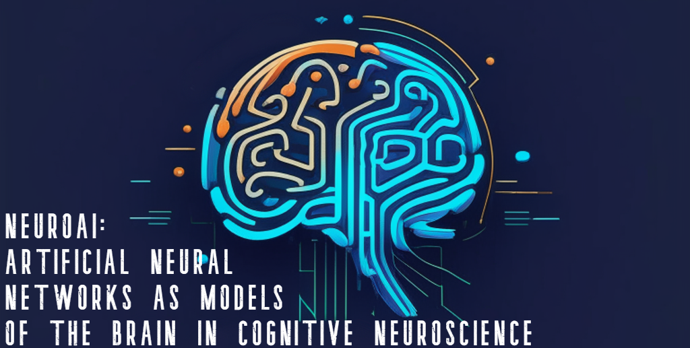

# Welcome

The NeuroAI educational workshop is organized by Dr. Isil Poyraz Bilgin, Centre de recherche de l'Institut universitaire de gériatrie de Montréal (CRIUGM), Prof. Pierre Bellec, University of Montreal (UdeM), Dr. Elizabeth DuPre, Wu Tsai Neurosciences Institute, Stanford University, as part of the annual [Organization for Human Brain Mapping (OHBM) 2023 conference](https://www.humanbrainmapping.org/i4a/pages/index.cfm?pageid=4204).

The event is hold as an in-person event, however the pre-recording of the sessions will be accessible via OHBM's online platform. 

Majority of the speakers will present in-person but only one presenter due to their overlap with participating in another conference. 

The educational session features both theoretical lectures as well as hands-on tutorials. The hands-on tutorials will be held via online Jupyter Notebook implementations to facilitate the attendees' interaction with the materials. The attendees will not be required to bring a laptop, but following the demonstration given by the lecturer will be enough to grasp the generic aspects of the tutorials. 

The educational session will be finalized by a panel discussion, where the speakers of the each NeuroAI educational session will join in to share their opinions for questions either premade by the organization committee or asked by the audience.

There are thematic of the event: 

1. **Technical construction of the brain models**: An introduction of fundamental concepts applicability of AI in the neuroscience research;
2. **Brain decoding and encoding**: Identifying cognitive states based on brain activity (**brain decoding**); and predicting brain activity based on the activity of an artificial neural network (**brain encoding**);
3. **Multimodal overview of NeuroAI**: Implementation of AI in various sensory modality processing including vision, auditory, language.
4. **Ethics and future of NeuroAI**: Ethical concerns and potential future directions in the field.

This event will be held as a full day educational session starting at 8 am EST until 5 pm EST. There will be a lunch break at 12-1 pm EST, and two coffee breaks each of 30 min durations, one in the morning and one in the afternoon.

There will be continous access to water and coffee outside of the event room. 
